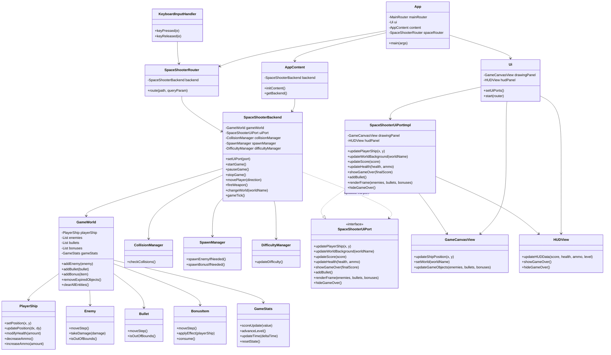

# Space Shooter Game

A Java Swing-based space shooter game that demonstrates a clean separation between game logic and presentation. The architecture is organized around a backend game engine, a domain model, and a UI layer that communicates through a dedicated port interface.

## Features

- Interactive gameplay with player movement and shooting
- Enemy spawning, collision detection, and scoring
- Difficulty progression and bonus items
- Swing-based rendering with a HUD and world selection controls
- Decoupled backend/UI communication through the UI port abstraction

## Architecture Overview

The system is structured into three primary layers:

- `team.control`: game orchestration, rules, and state updates
- `team.model`: domain entities such as the player ship, enemies, bullets, bonuses, and game statistics
- `ai.ui`: user interface components, rendering, and input handling

The following diagram summarizes the main relationships and the separation between the backend and UI:



## Communication Flow via the UI Port Interface

The backend and UI are intentionally decoupled. The core game loop runs in `SpaceShooterBackend`, while the presentation layer is handled by `Ui`, `GameCanvasView`, and `HUDView`.

Communication works as follows:

1. The UI creates a concrete implementation of `SpaceShooterUiPort` through `SpaceShooterUiPortImpl`.
2. `SpaceShooterBackend.setUiPort(...)` registers that implementation with the backend.
3. When gameplay state changes, the backend invokes methods such as `updatePlayerShip(...)`, `updateScore(...)`, `updateHealth(...)`, or `renderFrame(...)` on the port.
4. The implementation forwards those calls to the Swing UI components, keeping the game logic independent from rendering details.

This approach makes the backend easier to evolve while preserving a clear contract for UI updates.

## Project Structure

The project is organized under the following main packages:

- `src/ai/ui`: UI rendering, HUD, canvas, and keyboard input
- `src/team/control`: backend game control, collisions, spawning, and difficulty logic
- `src/team/model`: domain objects and game state
- `src/shared`: shared routing and UI port abstractions
- `src/my_base`: application bootstrap and content initialization

## Running the Project

### Prerequisites

- Java JDK 17 or newer
- VS Code with the Java extension pack installed

### Run in VS Code

1. Open the project folder in Visual Studio Code.
2. Open the file `src/my_base/App.java`.
3. Run the application using the Java extension's "Run Java" action or the built-in debugger.

### Alternate command-line approach

From the project root, compile and execute the application with:

```bash
cd SpaceShooterGame/System
javac -d out $(find src -name "*.java")
java -cp out my_base.App
```

> On Windows PowerShell, the same workflow can be run from the project directory using the Java extension or a compatible build tool.

## Notes

This repository is a student-style Java project that emphasizes architectural separation and object-oriented design. It is well suited for exploring how a game loop, domain model, and UI can be organized into distinct responsibilities.

### Sequence Diagrams
* [Game Start](sequence_game_start.mmd)
* [Player Movement](sequence_player_move.mmd)
* [Shooting](sequence_shooting.mmd)
* [Bonus Collection](sequence_bonus.mmd)
* [Bullet-Enemy Hit](sequence_hit.mmd)
* [Player-Enemy Collision](sequence_collision.mmd)
* [Game Over](sequence_game_over.mmd)

## Activity Diagrams
* [Game Initialization](activity_game_init.mmd)
* [Main Game Loop](activity_game_loop.mmd)
* [Collision Handling](activity_collision.mmd)
* [Game Over Flow](activity_game_over.mmd)

## Documentation Update